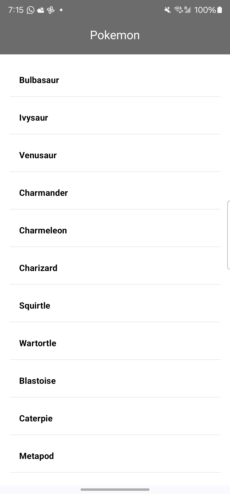
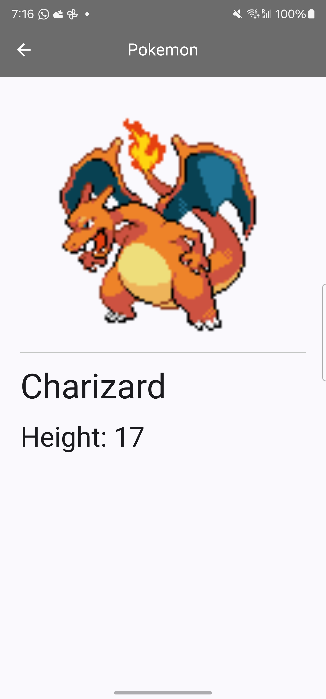

Min Sdk
  

# Pokemon

Hello.

The app is written in Kotlin with all the supported Unit and Instrumentation tests.

As such in this project i aim to demonstrate:

* Clean Architecture with MVVM (Model View ViewModel) on the presentation layer
* Use of Jetpack libraries
* Use of Kotlin's Coroutines and Flow for background execution
* Dependency Injection using Dagger Hilt
* Basic UI with material design.
* Finally it takes a sneak peak into github actions for autobuilds and ci using github actions

## Prerequisites

In order to run this project you need the following:
- Android Studio Koala Feature Drop
- JDK 17
- [Android SDK](https://developer.android.com/studio/index.html)

## How i went about it

 

In this project i tried keep a distinct separation of concerns. As shown in the pictorial illustration of clean architecture, this app is divided into three sub modules - Domain, Data and App.

### Domain Layer

The domain layer contains UseCase / Interactor instances that are used to collect data from the Data Layer and pass it to the Presentation Layer (App). As such in our context we have only one UseCase `GetForecast`. This layer does not have any mapper classes.

All the interfaces to be used in the data layer were defined here, also in accordance with the DIP principle, this is to make sure that all the modules depend on abstractions.

### Data Layer

The data layer is responsible for the data that will be fed to the entire application, in our case we had to fetch data from a remote source and display it to the user (open weather). As an agreement to the contract shared by the domain layer, concrete classes implementing the interfaces reside in this layer. With the aid of mapping we are able to have an exchange in abstractions between the two layers.

The networking here is performed by `Retrofit`. A popular Http client for android. Retrofit depends on `OkHttp` to make requests.
`Retrofit` also has builtin support for `Coroutines` hence my choice in the library. Persistence is to be achieved via `room`

### App (The presentation) Layer

This layer has houses all  Android Framework specific tooling i.e User Interface (UI) and  `ViewModels` which bridge the gap between the data abstractions and the UI. The architecture used in this layer was MVVM as it gives a good separation of concerns. The availability of lifecycle aware components also made the decision to go with MVVM an easy one to make. The ViewModels contain a reference to `UseCase` instances, these references are passed through dependency injection.

#### Tooling Used
`Jetpack Compose` this is an amazing tool, using binding adapters reduces a lot of boiler plate, thus making views cleaner.
`Coroutines` for all concurrency work.
`Dagger Hilt` Simple dependency management.
`Retrofit and okhttp` for api calls
`coil` for image loading
`JUnit` for unit tests
`espresso` for instrumentation tests

## Tests

Unit Tests are available for each layer and Instrumentation/ UI tests are present in the application layer. I tried to cover as much as i can, but i think there could still be room for more (especially in the UI tests)

## What to improve

- Paginating the pokemon list
- Implementing a local cache for the pokemon list
- Implementing a search feature for the pokemon list
- Adding more UI tests
- Improve the UI with some animations

## Libraries I chose to use

* [Kotlin](https://kotlinlang.org/)
* [Kotlin Coroutines](https://kotlinlang.org/docs/reference/coroutines-overview.html)
* [Flow](https://kotlinlang.org/docs/reference/coroutines/flow.html)
* [Retrofit](http://square.github.io/retrofit/) - An http client for android
* [Okhttp](http://square.github.io/okhttp/) - For networking requests
* [Mockk](https://mockk.io/) - For mocking instances
* [Dagger Hilt](https://dagger.dev/hilt/) - For dependency injection
* [Coil](https://coil-kt.github.io/coil/) - For image loading
* Jetpack Libraries
    * [ViewModel](https://developer.android.com/topic/libraries/architecture/viewmodel)
    * [Navigation](https://developer.android.com/guide/navigation)
    * [Room](https://developer.android.com/topic/libraries/architecture/room)
    * [Material Design](https://material.io/develop/android/docs/getting-started/)
    * [Compose](https://developer.android.com/jetpack/compose)
    * 
## Screenshots

 `Galaxy s22 ultra`

 

## Side note

Would have been nice to have a dark mode, but i think i will leave that for another day.
